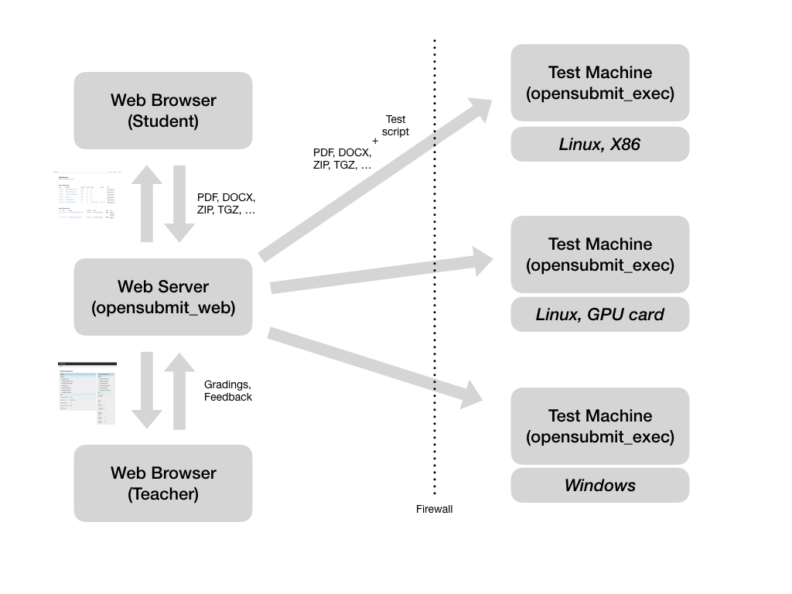

Welcome!
========

This is OpenSubmit, a small web application for managing assignment solutions in a university environment. It offers a trivial web page were **students can submit their assignment solutions**. 

.. image:: files/ui_student.png
   :align: center

Teachers and tutors use the backend interface to manage assignments, deadlines, and the gradings. Students are informed about the progress of their correction and their final
grade through email and the frontend page.

.. image:: files/ui_teacher.png
   :align: center

Other tools, such as `Moodle <https://docs.moodle.org/33/en/About_Moodle>`_, support not only
assignments, but also the management of learning material, the sophisticated tracking of course
progress and a fine-grained management of course access rights. If you want the all-inclusive solution, this is the wrong project.

The unique capability of OpenSubmit is the **validation of submissions**. The most common use case is a coding assignment:

A student hands in a ZIP file with source code. OpenSubmit takes this upload and extracts it on a separate machine, together with a validation script provided by the teacher.

The testing can happen before and after the assignment deadline. Results of a validation before the deadline are shown to the students. This makes the life of the corrector less miserable, because after the deadline, all gradable solutions are ‘valid’. Students also seem to like the idea of having a
validated solutions, so that they do not get a bad grade due to technical difficulties at the correctors side.

When the deadline is over, the system can run another invisible full test with the
student code the determine grading-relevant information.

.. toctree::
   :maxdepth: 2
   :hidden:

   frontend_use
   backend_use
   admin_use
   developer_use
   about
