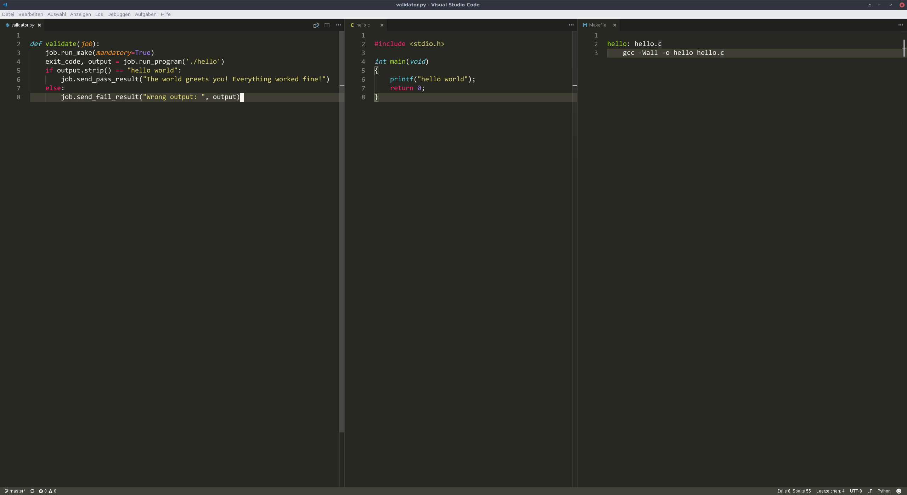

Tutorial on creating validators for student submissions
###################################################

Setting up the environment
**************************

opensubmit requires Python version 3.4 or higher.
Validators should be written in this version as well.
The current version of Python 3 can be installed using the following command:
``sudo apt-get install python3``

For testing the validator on your local machine the tool opensubmit-exec is required.
It can be obtained via using pip3.
To install pip3 use the following command.
``sudo apt-get install python3-pip``

To keep your Python standard installation clean use virtualenv for creating an virtual environment.
Use the following command for installing virtualenv.
``pip3 install virtualenv``

Use the following command for creating a new virtual environment in the desired directory (~/my_env in the following example).
``python3 -m virtualenv -p /usr/bin/python3 ~/my_env``

To switch to the newly created environment use ``source ~/my_env/bin/activate``.
To leave it use ``deactivate``.

Now you can install python packages as usual by using pip3.
For installing opensubmit-exec the following command is used.
``sudo pip3 install opensubmit-exec``

If you want to use the beta version of the software use the following command.
0.7b3 can be replaced by the desired version.
``sudo pip3 install opensubmit-exec==0.7b3`` 

To use opensubmit-exec you have to switch to the corresponding virtual environment.
``source ~/my_env/bin/activate``

///
The next step is to configure opensubmit-exec.
``sudo opensubmit-exec configure``
On the first run a config file is created which can be changed accordingly.
Run ``sudo opensubmit-exec configure`` again afterwards.
///

Creating validators and using opensubmit-exec
*********************************************

The creation of a validator is illustrated by the following example.
The students have to create a program in C that prints 'hello world' to the command prompt.
They have to submit the corresponding c-file and the Makefile, which creates a program called 'hello'.

A validator is a python-file named validator.py containing a validate function, which is given an job-object as parameter.
The following picture shows a validator for a hello-world program.
A makfile which creates the according executable is delivered as well.

In some cases it is necessary to use multiple files for validation.
Then you have to create an archive named validator.zip containing the according files.

opensubmit-exec can be used for testing such validators.
The command ``opensubmit-exec test path/to/desired/directory/hello`` tests the directory hello, which contains a validator.py file or an validatory.py archive.
Also it has to contain an exemplary student submission archive, which can be named as you wish. 
The submission is validated and you can check if everything is working correctly.

Examples for validators
***********************